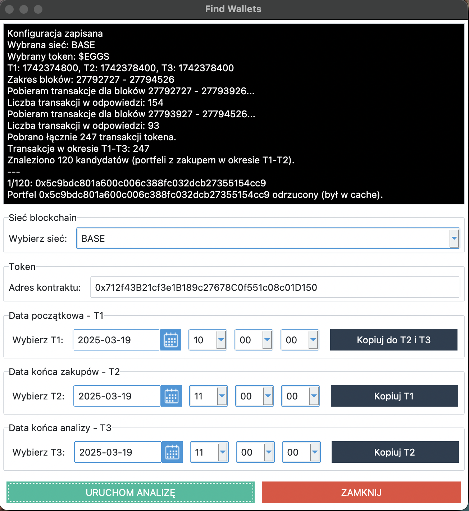
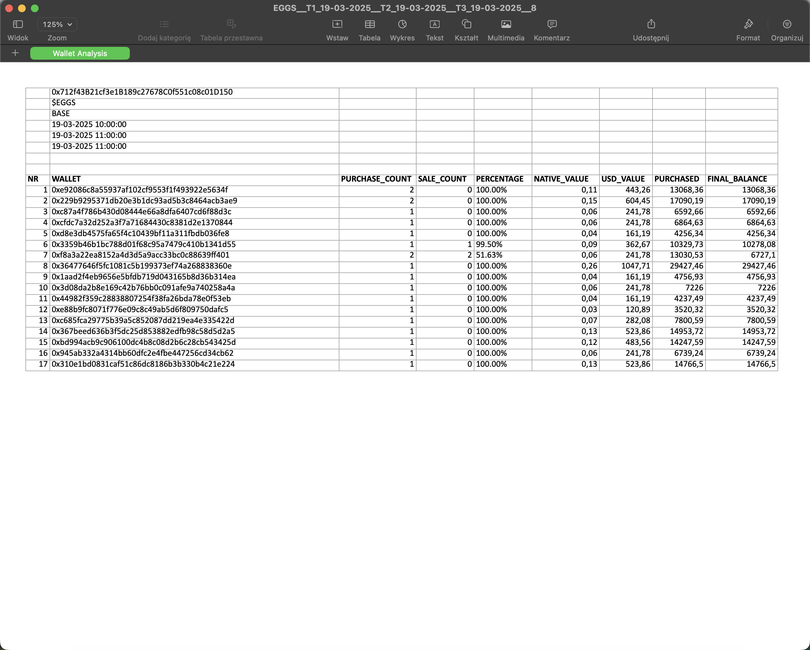

## Opis

Aplikacja analizuje transakcje blockchain w trzech kluczowych punktach czasowych (T1, T2, T3), gdzie T1-T2 to okres zakupów, a T3 to moment weryfikacji. System automatycznie filtruje boty i podejrzane portfele poprzez analizę częstotliwości transakcji, sprawdzając czy odstępy między operacjami nie są zbyt krótkie. 

Narzędzie pobiera dane z sieci blockchain przez dedykowane API, kalkuluje aktualne kursy tokenów oraz przelicza wartości na USD. Wykryte portfele muszą spełniać kryteria: zachowanie minimum 50% zakupionych tokenów oraz posiadanie wartości powyżej 100 USD w momencie T3.

Wszystkie wyniki są eksportowane do pliku Excel zawierających historię transakcji, analizy sald oraz statystyki każdego portfela. Aplikacja oferuje intuicyjny interfejs graficzny z podglądem logów w czasie rzeczywistym oraz zaawansowany system cachowania dla optymalizacji wydajności podczas przetwarzania dużych ilości danych blockchain. 

## Najważniejsze funkcjonalności

-  **Automatyczna analiza portfeli** - wyszukiwanie i analiza transakcji kryptowalut
-  **Eksport do Excel** - generowanie szczegółowych raportów w formacie .xlsx
-  **Śledzenie kursów walut** - automatyczne pobieranie aktualnych kursów
-  **Interfejs graficzny** - intuicyjna aplikacja GUI z podglądem logów
-  **Analiza częstotliwości transakcji** - wykrywanie podejrzanych wzorców aktywności
-  **System cachowania** - optymalizacja wydajności poprzez buforowanie danych

## Wymagania

- Python 3.10+
- requests
- openpyxl
- ttkbootstrap

## Instalacja

```bash
git clone https://github.com/adrian-wiszowaty/find-crypto-wallets.git
cd find-crypto-wallets
pip install requests openpyxl ttkbootstrap
```

## Konfiguracja

Podstawowe dane jak daty, sieć i nr kontraktu definiujemy w GUI, natomiast bardziej zaawansowane dane jak np jaką wartość procentową ma posiadać portfel na dzień T3 definiujemy w stałych w katalogu 'constants'.

### Parametry konfiguracji:

- `NETWORK` - sieć blockchain
- `T1_STR`, `T2_STR`, `T3_STR` - punkty czasowe do analizy (format: DD-MM-YYYY HH:MM:SS)
- `TOKEN_CONTRACT_ADDRESS` - adres kontraktu tokena do analizy

## Uruchomienie

```bash
python app.py
```

## Przykład działania

Po uruchomieniu aplikacja:

1. **Ładuje interfejs graficzny** z konfigurowalnymi parametrami
2. **Analizuje transakcje** w wybranych przedziałach czasowych
3. **Pobiera dane z blockchain** API dla wybranej sieci
4. **Generuje raporty Excel** z wynikami analizy portfeli
5. **Wyświetla logi** w czasie rzeczywistym w interfejsie użytkownika
6. **Zapisuje wyniki** w folderze `wallets/`

### Struktura wygenerowanych raportów:
- Szczegółowe informacje o portfelach
- Analiza częstotliwości i wzorców transakcji
- Wartości w USD z aktualnymi kursami

## Zrzuty ekranu




## Technologie

- **Python 3** - język programowania
- **tkinter + ttkbootstrap** - interfejs graficzny
- **openpyxl** - generowanie plików Excel
- **requests** - komunikacja z API blockchain
- **BASE Network API** - dane blockchain

## Licencja

MIT