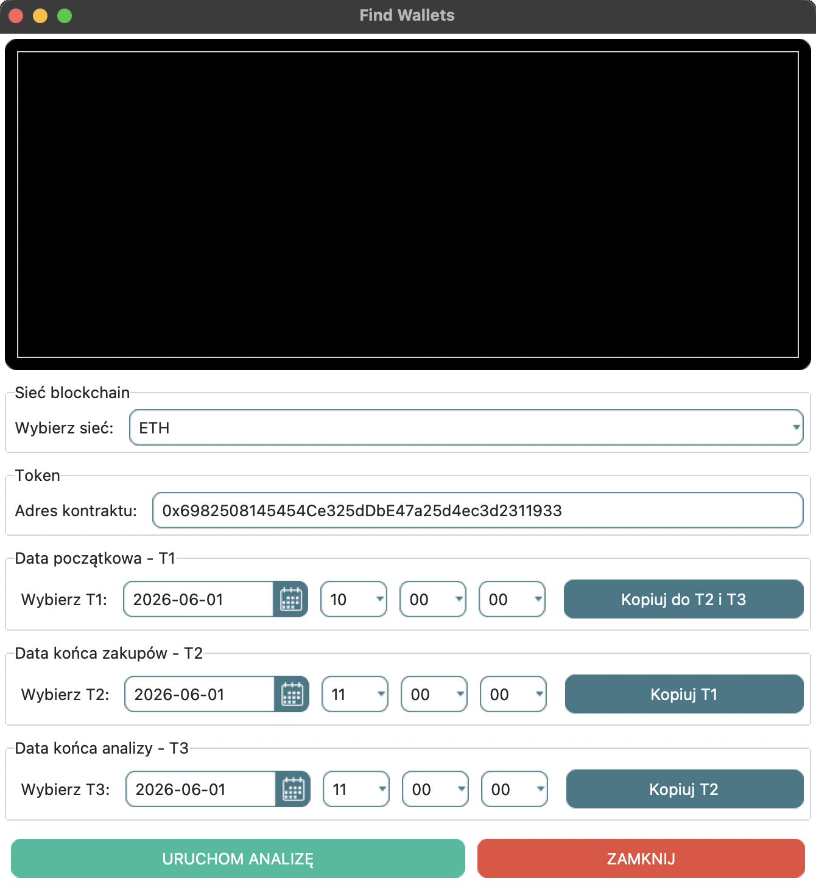
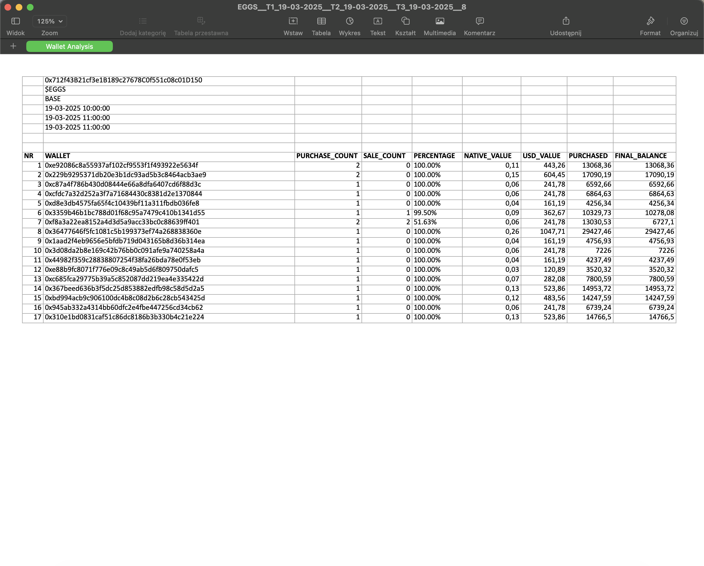

# Find Crypto Wallets

[](https://github.com/Adrian-Wiszowaty/find-crypto-wallets/actions/workflows/ci.yml)

Narzędzie z interfejsem graficznym, które wyszukuje portfele early-buyerów danego tokena ERC-20.
Podajesz adres kontraktu i trzy punkty w czasie, a aplikacja pobiera transakcje on-chain,
odfiltrowuje boty, wybiera portfele które kupiły wcześnie i utrzymały tokeny, po czym wycenia
ich salda w USD i zapisuje wynik do pliku Excel.

## Skąd pomysł

Zaczęło się od ręcznego przeglądania Etherscana. Chciałem sprawdzić, które portfele kupiły dany
token w pierwszych godzinach po starcie i faktycznie go utrzymały — zamiast sprzedać po kilku
minutach jak boty. Przy setkach transferów w oknie czasowym robienie tego ręcznie było mozolne
i łatwo było coś przeoczyć.

Napisałem więc skrypt, który pobiera wszystkie transfery tokena w zadanym przedziale, grupuje je
po portfelach i sam liczy, kto kupił, ile utrzymał i ile to było warte na wybrany dzień. Z czasem
dorosło to do narzędzia z GUI, filtrowaniem botów i eksportem do Excela.

## Co potrafi

- Pobiera wszystkie transfery tokena z zadanego okna czasowego (T1-T3) z wybranej sieci.
- Wskazuje portfele, które kupiły w oknie zakupów (T1-T2) i utrzymały tokeny do dnia weryfikacji (T3).
- Odfiltrowuje boty i podejrzane adresy na podstawie częstotliwości transakcji.
- Wycenia pozostałe salda w tokenie natywnym i w USD (Dexscreener + CoinGecko).
- Eksportuje gotowy ranking do pliku `.xlsx`.

## Przykład




## Jak to działa

Aplikacja prowadzi przez cztery etapy:

1. **Konfiguracja** — w GUI wybierasz sieć, wklejasz adres kontraktu i ustawiasz trzy znaczniki
   czasu: początek zakupów (T1), koniec zakupów (T2) i dzień weryfikacji (T3).
2. **Pobieranie** — daty są zamieniane na numery bloków, a transfery tokena ściągane z Etherscan
   V2 API porcjami po zakresach bloków.
3. **Filtrowanie** — transakcje są grupowane po portfelach; kandydaci z okna T1-T2 przechodzą
   przez analizę częstotliwości, która odrzuca boty.
4. **Wycena i raport** — dla portfeli, które utrzymały minimum 50% zakupu, liczone jest saldo na
   dzień T3, przeliczane na USD i zapisywane do Excela.

Logika jest rozbita na warstwy: pobieranie danych, analiza portfeli, wycena i raport. Klient API
jest wstrzykiwany do serwisów (dependency injection), więc każdą część da się testować osobno, a
definicje sieci (ETH, BSC, Base) siedzą w jednym miejscu — dołożenie kolejnej sprowadza się do
dopisania wpisu w `network_constants.py`.

```text
backend/
  api_client.py             zapytania do Etherscan / Dexscreener / CoinGecko z ponawianiem
  blockchain_analyzer.py    bloki oraz pobieranie i grupowanie transakcji tokena
  wallet_analyzer.py        filtrowanie botów i symulacja sald portfeli (Decimal)
  exchange_rate_service.py  kursy tokena i przeliczenie na USD, z cachowaniem par
  excel_reporter.py         generowanie raportu .xlsx
  config_manager.py         konfiguracja i definicje obsługiwanych sieci
  wallet_processor.py       spina cały przepływ analizy
frontend/
  gui_app.py                interfejs graficzny (ttkbootstrap) z podglądem logów
shared/
  constants/                progi analizy, sieci, formaty i komunikaty
  datetime_helper.py        parsowanie dat w strefie Europe/Warsaw
```

## Wymagania

- Python 3.9+
- Darmowy klucz API Etherscan (jeden klucz działa dla ETH, BSC i Base)

## Instalacja

```bash
git clone https://github.com/Adrian-Wiszowaty/find-crypto-wallets.git
cd find-crypto-wallets
python -m venv .venv && source .venv/bin/activate
pip install -e .
cp .env.example .env
```

Otwórz `.env` i wklej klucz API. Darmowy klucz Etherscan wygenerujesz na
<https://etherscan.io/myapikey>.

## Uruchomienie

```bash
python app.py
```

W oknie aplikacji wybierasz sieć, wklejasz adres kontraktu tokena, ustawiasz trzy znaczniki czasu
(T1 ≤ T2 ≤ T3) i klikasz **Uruchom analizę**. Logi lecą na żywo w oknie, a gotowy raport ląduje
w folderze `wallets/`.

## Konfiguracja

Klucz API trzymany jest w `.env` (wzór w `.env.example`), pozostałe parametry ustawiasz w GUI lub
w stałych. Daty podajesz w formacie `DD-MM-YYYY HH:MM:SS` (czas lokalny Europe/Warsaw).

| Parametr | Gdzie | Opis |
|---|---|---|
| `ETHERSCAN_API_KEY` | `.env` | Klucz API Etherscan (wymagany) |
| `NETWORK` | GUI | Sieć: `ETH`, `BSC` lub `BASE` (domyślnie `ETH`) |
| `T1`, `T2`, `T3` | GUI | Początek zakupów, koniec zakupów, dzień weryfikacji |
| `TOKEN_CONTRACT_ADDRESS` | GUI | Adres kontraktu analizowanego tokena |
| `MIN_BALANCE_PERCENTAGE` | `api_constants.py` | Minimalny % zakupu, jaki portfel musi utrzymać do T3 (domyślnie 50) |
| `MIN_USD_VALUE` | `api_constants.py` | Minimalna wartość salda w USD, by portfel trafił do raportu (domyślnie 100) |

Pozostałe progi (częstotliwość transakcji, rozmiar porcji bloków, limity ponawiania) znajdziesz
w `shared/constants/api_constants.py`.

## Testy

```bash
pip install -e ".[dev]"
pytest
```

## Licencja

MIT — szczegóły w [LICENSE](LICENSE).
